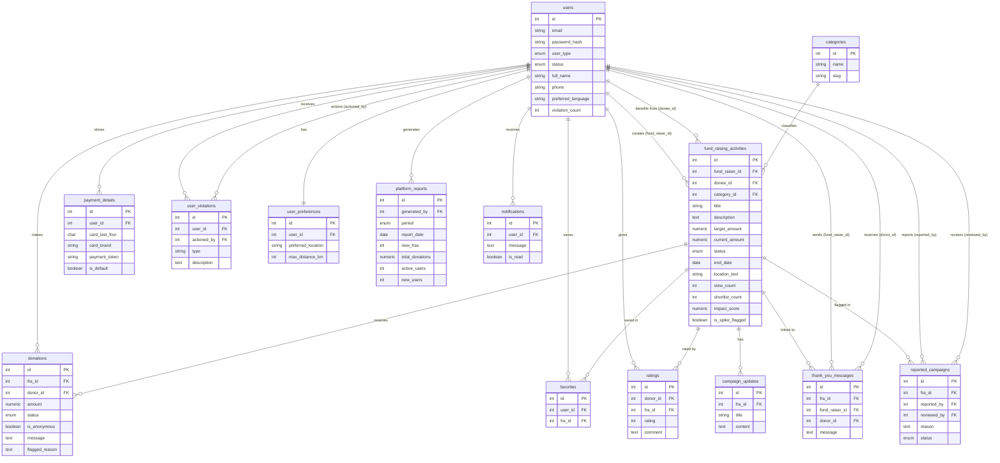

# Database Schema

**Database:** PostgreSQL 15
**File:** `bingbongfundraisers/db/init.sql`

---

## Tables Overview

| Table | Purpose |
|---|---|
| `users` | All user accounts (fund raiser, donee, donor, user admin, platform management) |
| `categories` | FRA categories managed by platform |
| `fund_raising_activities` | Campaigns created by fund raisers, linked to a donee |
| `donations` | Donations made by donors |
| `payment_details` | Saved payment info per user (tokenized) |
| `favorites` | FRAs shortlisted by donees |
| `ratings` | Donee rates their donation experience |
| `campaign_updates` | Updates posted by fund raisers on their FRA |
| `thank_you_messages` | Fund raiser thanks a specific donor |
| `reported_campaigns` | FRAs reported by users, reviewed by admin |
| `user_violations` | Violation records for flagged users |
| `user_preferences` | Language, location, category preferences per user |
| `platform_reports` | Daily/weekly/monthly activity reports |
| `notifications` | In-app notifications sent to users |

---

## Relationships

- One **user** (fund_raiser) → many **fund_raising_activities** (via `fund_raiser_id`)
- One **user** (donee) → many **fund_raising_activities** (via `donee_id`)
- One **user** (donor) → many **donations**
- One **user** → many **favorites**
- One **user** → many **ratings**
- One **user** → one **user_preferences**
- One **user** → many **payment_details**
- One **user** → many **user_violations**
- One **user** → many **notifications**
- One **category** → many **fund_raising_activities**
- One **fund_raising_activity** → many **donations**
- One **fund_raising_activity** → many **favorites**
- One **fund_raising_activity** → many **ratings**
- One **fund_raising_activity** → many **campaign_updates**
- One **fund_raising_activity** → many **thank_you_messages**
- One **fund_raising_activity** → many **reported_campaigns**

---

## ER Diagram

---

## User Types

The `users` table handles all user types via the `user_type` column:

| user_type | Role |
|---|---|
| `fund_raiser` | Creates and manages FRAs |
| `donee` | Linked to FRAs as the beneficiary |
| `donor` | Searches and donates to FRAs |
| `user_admin` | Reviews violations and reported campaigns |
| `platform_management` | Manages categories and generates reports |
